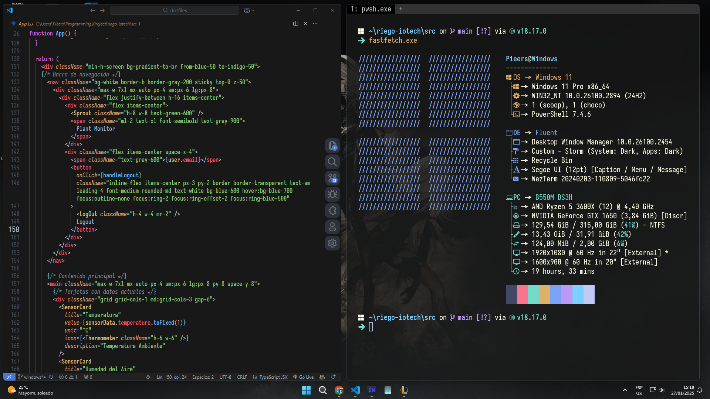

# Dotfiles

Configuración personal de dotfiles para Windows 11, con énfasis en:

## Terminal
- **PowerShell**: Shell principal con módulos como PSReadLine, PSFzf y Terminal-Icons
- **Starship**: Prompt personalizado y minimalista

## Editores
- **VS Code**: Editor principal con tema One Dark Pro personalizado y keybindings estilo Emacs

## Paquetes
- Gestión con winget y Microsoft Store
- Utilidades: 7zip, Git, fzf, fastfetch
- Apps: Discord, Flameshot
